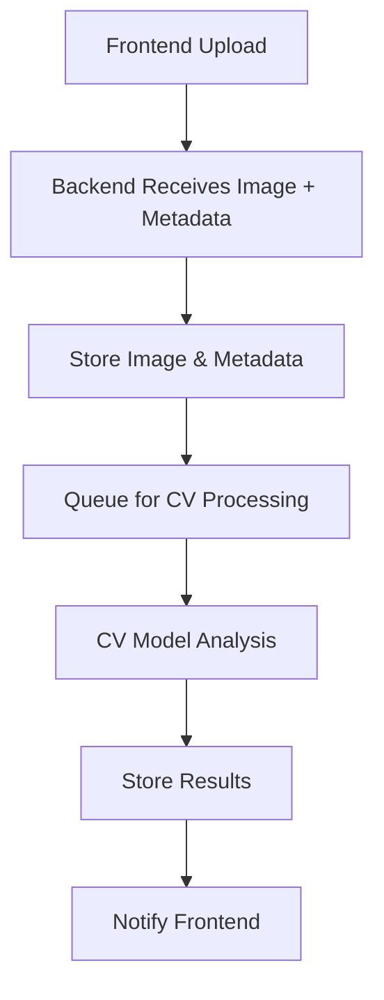

# 🔗 Backend Integration Guide

This document explains all the backend integration points in your Infrastructure Damage Reporter application and how to switch from the current local setup to your team's backend when ready.

## 📍 **Current Integration Points**

### **1. Primary Upload Endpoint**
**Location:** `app/components/ImageUpload.tsx` → `handleSubmit()`
**Current URL:** `/api/upload` (local Next.js API)
**Future URL:** `https://your-backend.com/api/v1/upload`

```typescript
// Current implementation uses backendService
const result = await backendService.uploadImage(selectedImage, metadata);
```

### **2. Configuration Management**
**Location:** `app/config/backend.ts`
**Purpose:** Central configuration for all backend endpoints

```typescript
// Switch environments here when your backend is ready
export const CURRENT_ENV: keyof typeof BACKEND_CONFIG = 'CURRENT'; // Change to 'PRODUCTION'
```

### **3. API Service Layer**
**Location:** `app/services/backendService.ts`
**Purpose:** Handles all backend communication

## 🚀 **Available Backend Endpoints**

### **Core Endpoints (Ready for Implementation)**

| Endpoint | Method | Purpose | Status |
|----------|--------|---------|--------|
| `/api/v1/upload` | POST | Upload image + metadata | ✅ Frontend Ready |
| `/api/v1/process` | POST | Trigger CV processing | ✅ Frontend Ready |
| `/api/v1/results/{id}` | GET | Get processing results | ✅ Frontend Ready |
| `/api/v1/history` | GET | Get upload history | ✅ Frontend Ready |

### **Specialized Endpoints (Optional)**

| Endpoint | Method | Purpose | Status |
|----------|--------|---------|--------|
| `/api/v1/classify` | POST | Damage type classification | ✅ Frontend Ready |
| `/api/v1/severity` | POST | Severity assessment | ✅ Frontend Ready |
| `/api/v1/locations` | GET | Location-based queries | ✅ Frontend Ready |

## 📋 **Data Formats**

### **Upload Request Format**
```typescript
// FormData sent to backend
{
  image: File,           // The actual image file
  metadata: string       // JSON stringified metadata object
}
```

### **Metadata Structure**
```typescript
interface ImageMetadata {
  filename: string;
  size: number;
  type: string;
  lastModified: Date;
  dimensions?: {
    width: number;
    height: number;
  };
  location?: {
    latitude: number;      // GPS latitude
    longitude: number;     // GPS longitude
    altitude?: number;     // GPS altitude (meters)
  };
  camera?: {
    make?: string;         // e.g., "Apple"
    model?: string;        // e.g., "iPhone 15 Pro"
    software?: string;     // e.g., "iOS 17.1"
  };
  timestamp?: {
    dateTime?: string;           // Last modified time
    dateTimeOriginal?: string;   // Original capture time
  };
}
```

### **Expected Response Format**
```typescript
interface UploadResponse {
  success: boolean;
  message: string;
  data: {
    id: string;              // Unique image ID for tracking
    filename: string;        // Server filename
    originalName: string;    // Original filename
    path?: string;          // Server file path
    size: number;           // File size in bytes
    type: string;           // MIME type
    uploadedAt: string;     // ISO timestamp
    metadata: ImageMetadata; // Extracted metadata
    processingStatus?: 'pending' | 'processing' | 'completed' | 'failed';
  };
}
```

## 🔄 **How to Switch to Your Backend**

### **Step 1: Update Configuration**
```typescript
// In app/config/backend.ts
export const CURRENT_ENV = 'PRODUCTION'; // Change from 'CURRENT'

// Update the PRODUCTION config with your URLs
PRODUCTION: {
  baseUrl: 'https://your-actual-backend.com',
  uploadEndpoint: '/api/v1/upload',
  // ... other endpoints
}
```

### **Step 2: Add Authentication (if needed)**
```typescript
// In app/services/backendService.ts
// Uncomment and update headers in uploadImage method:

const response = await fetch(url, {
  method: 'POST',
  body: formData,
  headers: {
    'Authorization': 'Bearer ' + getAuthToken(),
    'X-API-Key': process.env.NEXT_PUBLIC_API_KEY,
  },
});
```

### **Step 3: Test Integration**
1. Update `CURRENT_ENV` to point to your staging environment first
2. Test image upload functionality
3. Verify metadata is received correctly
4. Switch to production when ready

## 🛠 **Backend Requirements**

### **Minimum Requirements for Your Backend**
1. **Accept multipart/form-data** for image uploads
2. **Parse JSON metadata** from form field
3. **Return structured response** matching `UploadResponse` format
4. **Generate unique IDs** for tracking images
5. **Store images** in accessible location for CV processing

### **Recommended Enhancements**
1. **Authentication/Authorization** system
2. **Rate limiting** for uploads
3. **Image validation** (file type, size, content)
4. **Virus scanning** for uploaded files
5. **Database storage** for metadata
6. **Queue system** for CV processing
7. **Webhook notifications** for processing completion

## 📊 **Computer Vision Integration**

### **Processing Workflow**


### **CV Processing Data**
The frontend sends you everything needed for CV analysis:

1. **Image File**: High-quality image ready for processing
2. **GPS Coordinates**: For location-based analysis
3. **Image Metadata**: Camera info, dimensions, timestamps
4. **Unique ID**: For tracking through your processing pipeline

## 🔍 **Example Backend Implementation**

### **Express.js/Node.js Example**
```javascript
// Example backend endpoint structure
app.post('/api/v1/upload', upload.single('image'), async (req, res) => {
  try {
    const { file } = req;
    const metadata = JSON.parse(req.body.metadata);
    
    // Generate unique ID
    const imageId = generateUniqueId();
    
    // Store file
    const storedPath = await storeImage(file, imageId);
    
    // Save metadata to database
    await saveMetadata(imageId, metadata, storedPath);
    
    // Queue for CV processing
    await queueForProcessing(imageId);
    
    res.json({
      success: true,
      message: 'Image uploaded successfully',
      data: {
        id: imageId,
        filename: storedPath,
        originalName: file.originalname,
        size: file.size,
        type: file.mimetype,
        uploadedAt: new Date().toISOString(),
        metadata: metadata,
        processingStatus: 'pending'
      }
    });
  } catch (error) {
    res.status(500).json({ error: error.message });
  }
});
```

## 📝 **Next Steps**

1. **Review this integration guide** with your team
2. **Implement the upload endpoint** matching the expected format
3. **Test with staging environment** first
4. **Add computer vision processing** workflow
5. **Implement additional endpoints** as needed
6. **Add authentication and security** measures

## 🎯 **Quick Start Checklist**

- [ ] Backend accepts POST to `/api/v1/upload`
- [ ] Backend handles multipart/form-data
- [ ] Backend parses JSON metadata field
- [ ] Backend returns proper response format
- [ ] Update `CURRENT_ENV` in `backend.ts`
- [ ] Test upload functionality
- [ ] Implement CV processing workflow

## 💡 **Tips for Your Team**

1. **Start Simple**: Implement just the upload endpoint first
2. **Use the Existing Local API** as a reference (`app/api/upload/route.ts`)
3. **Test Incrementally**: Use staging environment before production
4. **Monitor GPS Data**: Many images won't have GPS - handle gracefully
5. **Consider File Storage**: Use cloud storage (S3, etc.) for production
6. **Plan for Scale**: Consider image resizing, compression, and CDN

---

**Ready to integrate?** Update the configuration in `app/config/backend.ts` and your frontend will automatically start using your backend! 🚀