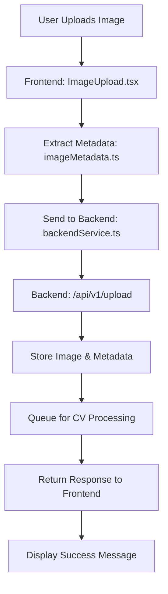

# 📁 Project Structure Overview

## 🏗️ Complete Project Organization

```
infrastructure-damage-reporter/
├── 📄 package.json                    # Root workspace configuration
├── 📄 README.md                       # Main project documentation
├── 📄 BACKEND_INTEGRATION.md          # Backend integration guide
├── 📄 .gitignore                      # Git ignore rules
│
├── 📁 frontend/                       # Next.js Frontend Application
│   ├── 📁 app/                        # Next.js App Router
│   │   ├── 📁 components/             # React Components
│   │   │   ├── 📄 ImageUpload.tsx     # Main image upload component
│   │   │   ├── 📄 ImageHistory.tsx    # Upload history display
│   │   │   └── 📄 DamageTypesInfo.tsx # Damage classification guide
│   │   ├── 📁 config/                 # Configuration files
│   │   │   └── 📄 backend.ts          # Backend endpoint configuration
│   │   ├── 📁 services/               # API service layer
│   │   │   └── 📄 backendService.ts   # Backend communication service
│   │   ├── 📁 utils/                  # Utility functions
│   │   │   └── 📄 imageMetadata.ts    # EXIF metadata extraction
│   │   ├── 📁 api/                    # Next.js API routes (local)
│   │   │   └── 📁 upload/
│   │   │       └── 📄 route.ts        # Local upload endpoint
│   │   ├── 📄 globals.css             # Global styles
│   │   ├── 📄 layout.tsx              # Root layout component
│   │   └── 📄 page.tsx                # Home page component
│   ├── 📁 public/                     # Static assets
│   ├── 📄 package.json                # Frontend dependencies
│   ├── 📄 next.config.ts              # Next.js configuration
│   ├── 📄 tsconfig.json               # TypeScript configuration
│   ├── 📄 tailwind.config.ts          # Tailwind CSS configuration
│   ├── 📄 postcss.config.mjs          # PostCSS configuration
│   ├── 📄 eslint.config.mjs           # ESLint configuration
│   └── 📄 README.md                   # Frontend documentation
│
└── 📁 backend/                        # Express.js Backend API
    ├── 📁 src/                        # Backend source code
    │   └── 📄 index.js                # Main server file
    ├── 📄 package.json                # Backend dependencies
    └── 📄 README.md                   # Backend documentation
```

## 🎯 Key Components Explained

### Frontend Architecture
- **App Router**: Modern Next.js routing system
- **Component-Based**: Reusable React components
- **Service Layer**: Abstracted API communication
- **Configuration-Driven**: Easy backend switching
- **TypeScript**: Full type safety

### Backend Architecture
- **Express.js**: RESTful API server
- **Modular Design**: Separate concerns
- **File Upload**: Multer integration
- **Error Handling**: Comprehensive error management
- **CV Ready**: Framework for computer vision integration

## 🔄 Workflow Integration

### Development Workflow
1. **Frontend Development**: `npm run dev:frontend` (port 3000)
2. **Backend Development**: `npm run dev:backend` (port 3001)
3. **Full Stack**: Run both simultaneously

### Production Workflow
1. **Frontend Build**: Creates optimized React app
2. **Backend Deploy**: Express server on cloud platform
3. **Integration**: Frontend calls backend APIs

## 🚀 Getting Started Commands

```bash
# Clone and setup
git clone <repository>
cd infrastructure-damage-reporter

# Install all dependencies
npm install

# Development (choose one)
npm run dev:frontend          # Frontend only
npm run dev:backend          # Backend only
npm run dev:frontend & npm run dev:backend  # Both

# Production builds
npm run build:frontend       # Build frontend
npm run build:backend        # Build backend
```

## 🔧 Configuration Points

### Frontend Configuration
- **Backend URLs**: `frontend/app/config/backend.ts`
- **Environment**: `frontend/.env.local`
- **Styling**: `frontend/tailwind.config.ts`

### Backend Configuration
- **Server Settings**: `backend/src/index.js`
- **Environment**: `backend/.env`
- **Dependencies**: `backend/package.json`

## 📦 Deployment Options

### Frontend Deployment
- **Vercel**: Automatic deployment
- **Netlify**: Static site hosting
- **Docker**: Container deployment
- **CDN**: Static file serving

### Backend Deployment
- **Railway**: Easy Node.js hosting
- **Heroku**: Platform as a service
- **AWS/GCP**: Cloud platforms
- **Docker**: Container orchestration

## 🔗 Integration Flow



## 🎨 Customization Points

### Frontend Customization
- **Components**: Add new React components
- **Styling**: Modify Tailwind classes
- **Features**: Extend ImageUpload functionality
- **Pages**: Add new Next.js pages

### Backend Customization
- **Endpoints**: Add new API routes
- **Models**: Integrate ML/CV models
- **Database**: Add database integration
- **Processing**: Implement image processing pipeline

## 📋 Next Steps

1. **Team Setup**: Each developer clones and runs locally
2. **Backend Development**: Implement CV processing in `backend/src/`
3. **Frontend Enhancement**: Add features in `frontend/app/components/`
4. **Integration Testing**: Test frontend-backend communication
5. **Production Deploy**: Deploy both frontend and backend
6. **Monitor & Scale**: Add logging, monitoring, and scaling

---

This organized structure separates concerns while maintaining seamless integration between frontend and backend! 🚀